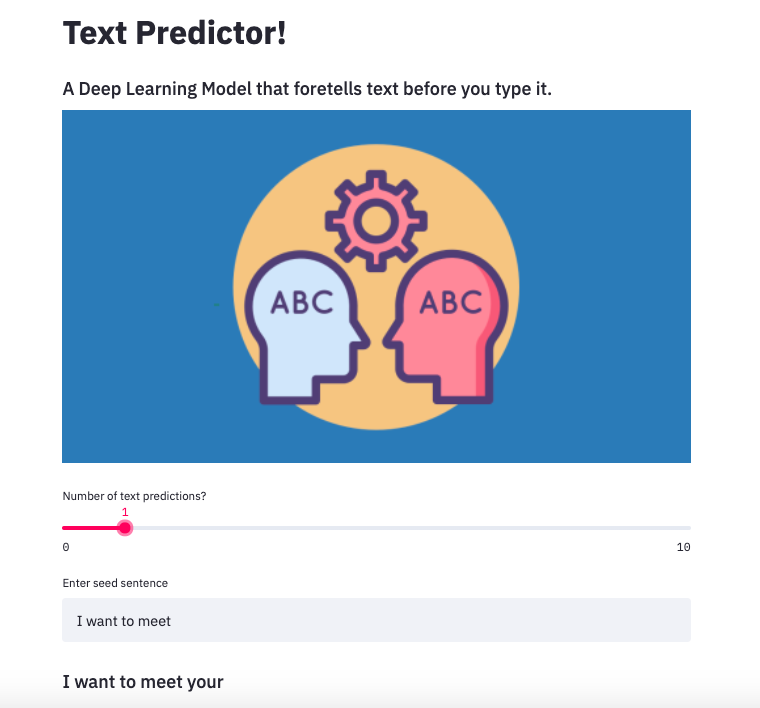

# streamlit_text_predictor


<p align="center">
<a href="https://dscommunity.in">
	
</a>
	<h2 align="center"> Text Predictor </h2>
	<h4 align="center"> A deep learning based sequence model used to predict forthcoming words in a sentence. In order to train this model, the popular drama/indie screenplay: Good Will Hunting was used. This corpus comprised of a total of 3293 unique words. Data preprocessing steps included removing whitespaces from the text file, converting the texts to lowercase and tokenizing them. The model uses 3 layers in total:
  1) An Eembedding Layer 
  2) A bidirectional LSTM layer with 150 units
  3) A Dense Layer with softmax activation.  <h4>
</p>

---
[](INSERT_LINK_FOR_DOCS_HERE) 
  [](INSERT_UI_LINK_HERE)

## Preview

## Functionalities
- [ ]  Generate auto-replies
- [ ]  Spell check/Autocorrection
- [ ]  Sentence completion

<br>


## Instructions to run

* Pre-requisites:
	-  TensorFlow 2.X
	-  Streamlit
  -  Python 3.5-3.8

* Use pip3 to install the current stable release of TensorFlow 2.X in your system
```bash
$ pip3 install --user --upgrade tensorflow
```

* Install Streamlit
```bash
$ pip install streamlit
```

* Executing the source file

```bash
$ streamlit run app.py
```

## Additional
For explanation and intuition behind the source code, refer to contributors article at: https://towardsdatascience.com/how-our-device-thinks-e1f5ab15071e


## Contributors

<table>
<tr align="center">


<td>

Ujjwal Kumar

<p align="center">

</p>
<p align="center">
<a href = "https://github.com/ujjwalkumar2607"></a>
<a href = "https://www.linkedin.com/in/ujjwal-kumar-2542771a7/">

</a>
</p>
</td>


</tr>
  </table>
  
## License
[](http://badges.mit-license.org)

<p align="center">
	Made with :heart: by <a href="https://dscommunity.in">DS Community SRM</a>
</p>


